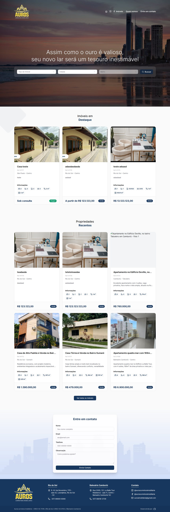
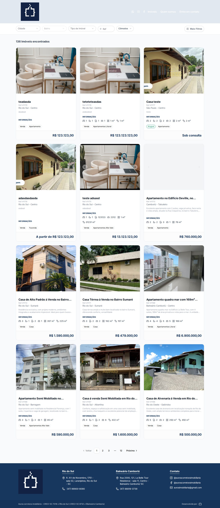
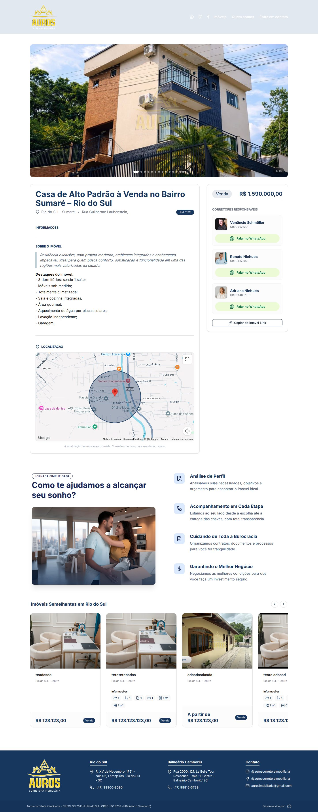
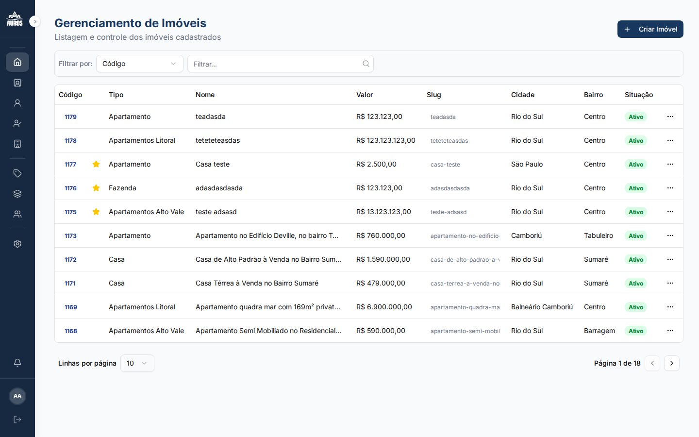

# auros-imob-web

Frontend da plataforma SaaS multi-tenant para imobiliárias. Um único Next.js serve o painel administrativo, os sites públicos white-label de cada imobiliária e o painel de super admin da plataforma.

---

## 📸 Screenshots

### Site público — Home (`/`)



### Site público — Listagem de imóveis (`/imoveis`)



### Site público — Detalhe do imóvel (`/imoveis/:id`)



### Sistema interno — Gerenciamento de imóveis



---

## 🚀 Stack

- **Framework**: Next.js 16 (App Router) + React 19 + TypeScript
- **Auth**: NextAuth v4 (strategy JWT)
- **UI**: Shadcn/ui + Tailwind CSS v4 + Radix UI
- **Data fetching**: TanStack Query v5
- **Formulários**: React Hook Form + Zod
- **Editor rich text**: Tiptap
- **Drag & drop**: @dnd-kit
- **Upload**: react-dropzone + react-easy-crop
- **Ícones**: lucide-react e @phosphor-icons/react
- **Toast**: sonner
- **Monitoramento**: Sentry

---

## 🏢 Multi-tenancy

Cada imobiliária (tenant) tem seu próprio site público, resolvido dinamicamente pelo `middleware.ts` a partir do hostname da requisição:

1. **Hostname conhecido** (ex: `aurosimobiliaria.com.br`) → rewrite para o site dedicado daquele tenant
2. **Hostname desconhecido** → resolve via `GET /resolve-tenant?hostname=` na API
3. **Super admin** (`admin.codelabz.com.br`) → painel de plataforma, exige role `SUPER_ADMIN`
4. **Local dev** → usa `NEXT_PUBLIC_AGENCY_ID` ou o cookie `__dev_domain__`

O tenant é propagado via header `x-tenant-id` (Server Components) e cookie `__tenant__` (Client Components).

## ✨ Funcionalidades

- 🏠 **Gestão de imóveis** — cadastro, edição, fotos com crop/reordenação (limite de 15 por imóvel), imóveis em destaque
- 👥 **CRM** — kanban de pipeline de vendas, timeline de contatos, origem de leads
- 📊 **Dashboard de métricas** — visualizações por dia, origem de tráfego, imóveis mais vistos
- 🏢 **Multi-tenant** — sites públicos white-label por domínio, cores e identidade visual configuráveis por imobiliária
- 👔 **Gestão de equipe** — corretores, usuários e papéis (`OWNER`, `MANAGER`, `REALTOR`)
- 💳 **Planos e cobrança** — planos por tenant (Starter, Professional, Enterprise) via Stripe
- 🔐 **Painel super admin** — gerenciamento de agências e planos da plataforma inteira

---

## 📦 Setup local

### 1. Instalar dependências

```bash
npm install
```

### 2. Rodar o servidor de desenvolvimento

```bash
npm run dev
```

Acesse [http://localhost:3000](http://localhost:3000).

### 3. Build de produção

```bash
npm run build
npm start
```

### 4. Lint

```bash
npm run lint
```

---

## 🔧 Variáveis de ambiente

```bash
NEXTAUTH_SECRET
NEXTAUTH_URL
NEXT_PUBLIC_API_URL
NEXT_PUBLIC_AGENCY_ID       # Fallback de tenant em dev local
NEXT_PUBLIC_PLATFORM_DOMAIN # ex: codelabz.com.br
NEXT_PUBLIC_DEV_DOMAIN      # Simula um tenant específico em dev local (ex: aurosimobiliaria.com.br)
```

---

## 📁 Estrutura de rotas (simplificada)

```bash
app/
  (aurosimobiliaria.com.br)/auros-site/   # Site público de um tenant customizado
  (imoveisgilli.com.br)/gilli-site/       # Site público de outro tenant customizado
  (generic-tenant)/generic-site/          # Site genérico (fallback dinâmico)
  admin/                                  # Painel admin do tenant
    imoveis/
    corretores/
    clientes/
    crm/
    configuracoes/
    empreendimentos/
    infraestruturas/
    tipo-imovel/
    usuarios/
    agencies/    # Super admin
    plans/       # Super admin
  login/
  api/           # Route handlers (NextAuth)
components/
  ui/            # Componentes Shadcn
  property-form/ # Formulário de imóvel (schema, uploader, crop)
middleware.ts    # Resolução de tenant + regras de auth
```

---

## 📜 Licença

Licença MIT - consulte a página [LICENÇA](https://opensource.org/licenses/MIT) para obter detalhes.
